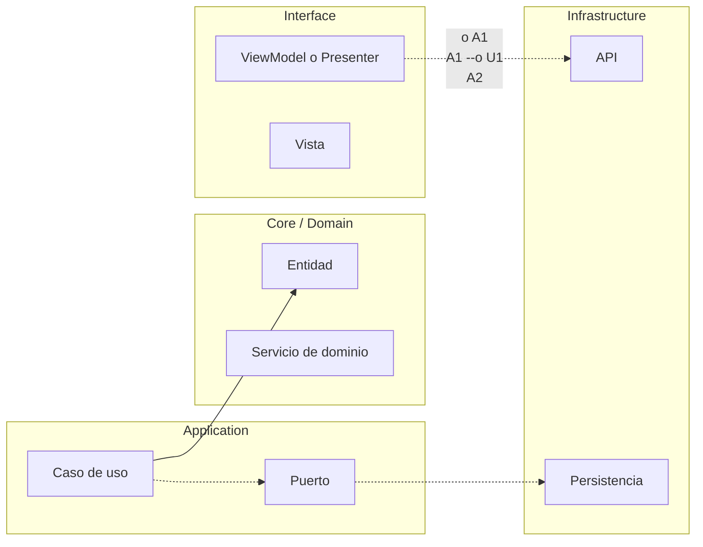

# TEMPLATE DIAGRAMA ARQUITECTURA MERMAID

## Uso
1. Copiar en leccion nueva o refactor de leccion existente.
2. Sustituir nombres de nodos por nombres reales de la app del modulo.
3. Mantener semantica de 4 flechas.

## Texto de soporte sugerido
1. `-->` representa ejecucion directa en runtime.
2. `-.->` representa contrato estable entre modulo y adaptador.
3. `-.o` representa wiring/composicion desde bootstrap o capa superior.
4. `--o` representa salida de estado/resultado hacia la capa consumidora.
