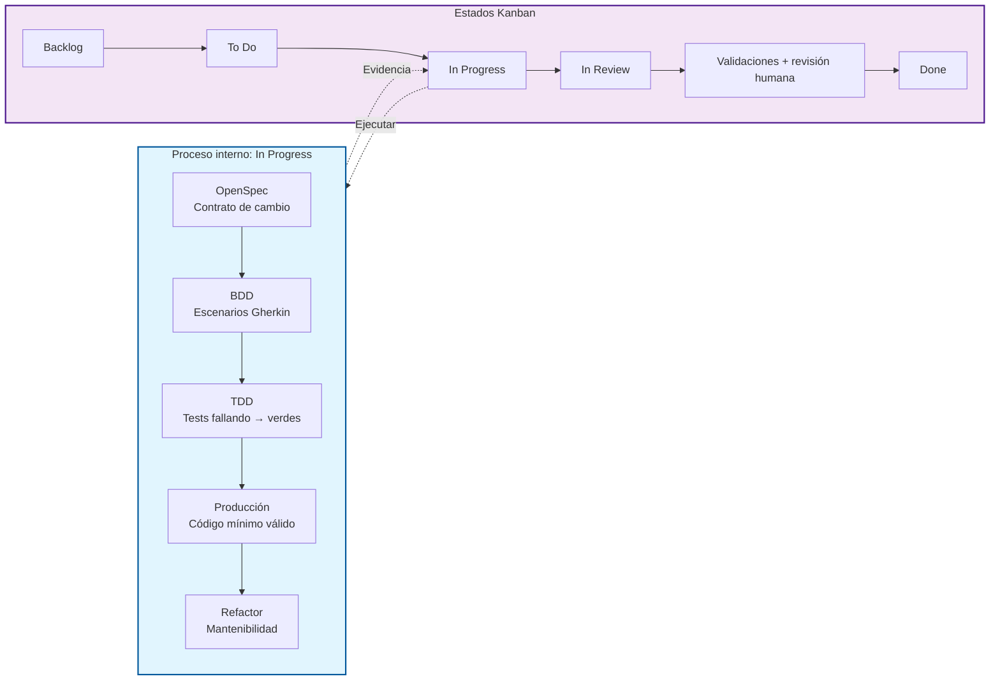
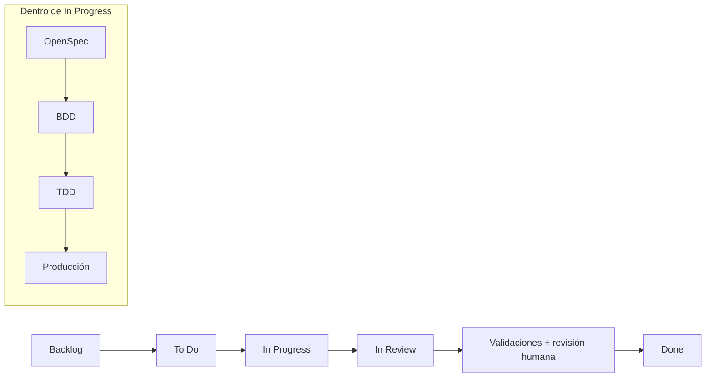

# Corrección del Workflow Kanban a Done

## Problema identificado

El diagrama original presentaba una bifurcación incorrecta desde **In Progress**:
- Una rama hacia **In Review**
- Otra rama hacia **OpenSpec + BDD + TDD + producción** (sin salida)

Esto rompía la coherencia del flujo porque el bloque "OpenSpec + BDD + TDD + producción" no conectaba con "Validaciones + revisión humana" ni con "Done".

---

## Diagrama corregido



---

## Decisión de modelado adoptada

### 1. Separación de responsabilidades
- **Estados Kanban (púrpura)**: Representan el flujo de valor del ticket a través del equipo
- **Proceso interno (azul)**: Representa la disciplina SDD que el desarrollador ejecuta dentro de In Progress

### 2. OpenSpec + BDD + TDD + producción como SUB-PROCESO
Estos elementos **NO son estados alternativos** a In Review. Son actividades obligatorias que ocurren **dentro** del estado In Progress:

| Fase | Propósito | Artefacto |
|------|-----------|-----------|
| OpenSpec | Definir el contrato del cambio | `proposal.md`, `spec.md` |
| BDD | Traducir requisitos a escenarios observables | Archivos `.feature` (Gherkin) |
| TDD | Blindar comportamiento contra regresiones | Tests unitarios |
| Producción | Implementar el mínimo código válido | Código fuente |
| Refactor | Dejar el código mantenible | Código limpio |

### 3. Flujo obligatorio hacia Done
Todo ticket debe pasar por:
```
In Progress (con SDD interno) 
    → In Review 
    → Validaciones + revisión humana 
    → Done
```

**Sin excepciones**: No existe camino alternativo que evite validaciones o revisión humana.

### 4. Gate de calidad explícito
La transición **Validaciones + revisión humana** actúa como quality gate obligatorio antes de Done, garantizando:
- Coherencia entre OpenSpec, BDD, TDD y código
- Evidencia trazable del ciclo SDD
- Aprobación humana del cambio

---

## Código Mermaid para reemplazar en el curso



O versión simplificada (una sola línea):

```mermaid
flowchart LR
    B[Backlog] --> TD[To Do] --> IP[In Progress] --> IR[In Review] --> VR[Validaciones + revisión humana] --> D[Done]
    
    note right of IP
      Proceso SDD:
      OpenSpec → BDD → TDD → Producción
    end note
```

---

## Justificación técnica

Esta corrección alinea el workflow con:
- **SDD (Specification-Driven Development)**: El proceso de especificación es parte del trabajo, no un estado paralelo
- **Auditoría**: Toda transición hacia Done pasa por validaciones
- **Kanban puro**: Los estados representan etapas de entrega de valor, no metodologías
